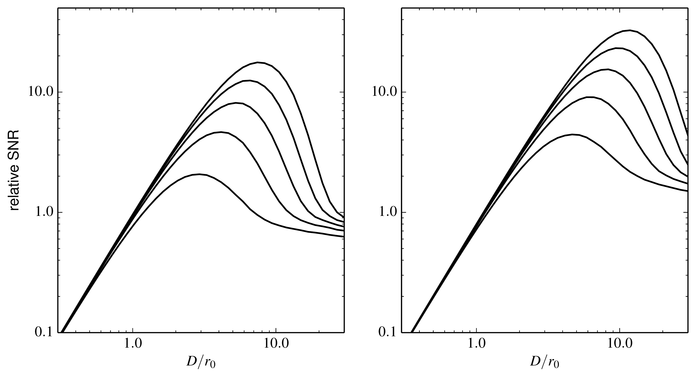

# Python optical interferometry simulation (pois)

This is a python package for simulating the data from a ground-based astronomical optical interferometer perturbed by atmospheric seeing perturbations. It is provided as supplementary material for the book ["Practical Optical Interferometry"](https://dbuscher.github.io/practical-optical-interferometry/), and is derived from the code which was used to provide data for many of the figures in the book.

## Introduction
This python package provides the building blocks to simulate the operation of a multi-telescope interferometer. These include functions to:

* generate simulated atmospheric turbulent wavefront perturbations
* correct these perturbations using adaptive optics
* combine beams from an arbitrary number of telescopes, with or without spatial filtering, to provide complex fringe visibility measurements.

The code has been written following a functional-programming style (in other words minimising side-effects in the code where possible) in order to try and make it modular and extensible. 

Example code using the package is in the [tests](tests) directory. The file [tests/test_visibility.py](tests/test_visibility.py) includes a complete simulation for determining visibility losses and single-mode fibre coupling losses as a function of the diameter of the telescopes.

## Requirements
The simulator runs under Python3 and requires `numpy`. Some of the demonstration code uses `astropy` for manipulating and saving data tables.

## Installation
On unix-like systems do
```
pip3 install pois
```

Alternatively download and unpack a copy of this repository and then use
```
python3 setup.py install
```

This should install the package into Python path and so it can be imported using
```python
from pois import *
```
or
```python
import pois
```

## Pronunciation
The package name should be pronounced as it would be in the phrase "petits pois".

## Licencing

The code is licenced under a 2-clause BSD licence (see [LICENCE](LICENCE)).
